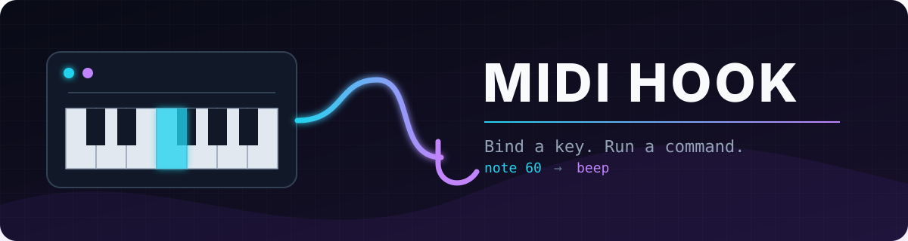

# MIDI Hook

Map MIDI notes to physical keyboard shortcuts, held keys, or shell commands on Linux, Windows, and macOS.

## Platform setup

### Linux

Setup reads the keyboard from `/dev/input`. Add your user to the `input` group, then log out and back in:

```sh
yay -S midi-hook # Arch Linux
sudo usermod -aG input "$USER"
```

Keyboard playback uses the kernel `uinput` interface directly. Ensure your user can write to `/dev/uinput`; no playback daemon is required.

### Windows

No extra keyboard software is required. MIDI Hook uses the native `SendInput` API.

### macOS

Grant your terminal or MIDI Hook Input Monitoring permission for capture and Accessibility permission for keyboard playback in System Settings → Privacy & Security.

## Setup

```sh
cargo run --release -- setup
# midi-hook setup
```

Select a MIDI input, an optional MIDI output for LED feedback, and, on Linux, a physical keyboard. Use a MIDI control, or hold one or more MIDI notes and release them all. For multiple notes, choose whether they are an unordered chord or ordered sequence. Next choose:

```text
s  Press and release a physical shortcut
t  Type a shortcut such as ctrl+space+f4+c
c  Type a shell command
```

Hold all keys in a shortcut at the same time, then release them. Setup records the exact press/release sequence. A single captured key, such as Ctrl, is held until the MIDI trigger is released. Press Esc to cancel physical capture if you selected the wrong keyboard.

Setup saves `commands.conf` and waits for the next MIDI trigger. Press Ctrl+C while it waits to exit.

## Test MIDI input

Print each pressed MIDI note number without running any mappings:

```sh
cargo run --release -- test
# Optional MIDI port index:
# midi-hook test 0
```

Detailed diagnostics:

```sh
cargo run --release -- test --details
# Optional MIDI port index:
# midi-hook test --details 0
```

Press Enter to stop.

## Listen

```sh
cargo run --release -- commands.conf
# midi-hook commands.conf
```

The listener connects to the saved MIDI device. Press Enter to stop it.

## Configuration

```text
device = RockJam BT MIDI:RockJam BT MIDI Bluetooth 128:0
output = RockJam BT MIDI:RockJam BT MIDI Bluetooth 128:0
60 = shortcut 57:1 35:1 35:0 57:0
61 = shortcut ctrl+space+f4+c
62 = key 29
63 = command notify-send "MIDI note 63"
64 = toggle spotify
65 [vel=1..49] = command notify-send "Soft press"
65 [vel=50..99] = command notify-send "Middle press"
65 [vel=100..127] = command notify-send "Hard press"
60+61+62 = command notify-send "MIDI chord pressed"
48>50>52 = command notify-send "MIDI sequence entered"
cc 64 = key 29
cc 76 = command wpctl set-volume @DEFAULT_SINK@ {value}%
```

A `+`-separated MIDI trigger runs once when all listed MIDI notes are held. It re-arms when any required note is released. A `>`-separated trigger requires note-on events in exactly that order; a wrong note resets progress. Single-note velocity conditions use inclusive ranges such as `65 [vel=50..99]`; NoteOff releases held-key and LED state. Velocity ranges must use values from 1 through 127. Chords and sequences ignore velocity. `cc N` activates held keys and shortcuts when control N has a value from 1 through 127 and releases them at 0. CC commands run for every nonzero value. Use `{value}` for the raw `0–127` value or `{percent}` for a scaled `0–100` value; parameterized commands also run at 0. This supports absolute knobs and faders. Sequences have no timeout. Single-note mappings still run independently.

When `output` is configured, active note mappings send MIDI NoteOn feedback and send NoteOff when released. This can drive controller LEDs. Sequences and CC mappings do not send LED feedback.

Manual keyboard shortcuts can use `+`-separated key names. Captured shortcuts and `key` actions store native key codes, so numeric mappings are not portable between operating systems. Commands run through `/bin/sh -c` on Linux/macOS and `cmd.exe /C` on Windows. Commands should terminate or detach themselves; MIDI Hook does not impose a timeout. A `toggle` action starts its command on the first trigger and stops its process tree on the next. MIDI Hook also stops active toggle commands when it exits. Launch the application executable directly; MIDI Hook does not kill an instance that was already running or a launcher that deliberately detaches. Only use configuration files you trust.
